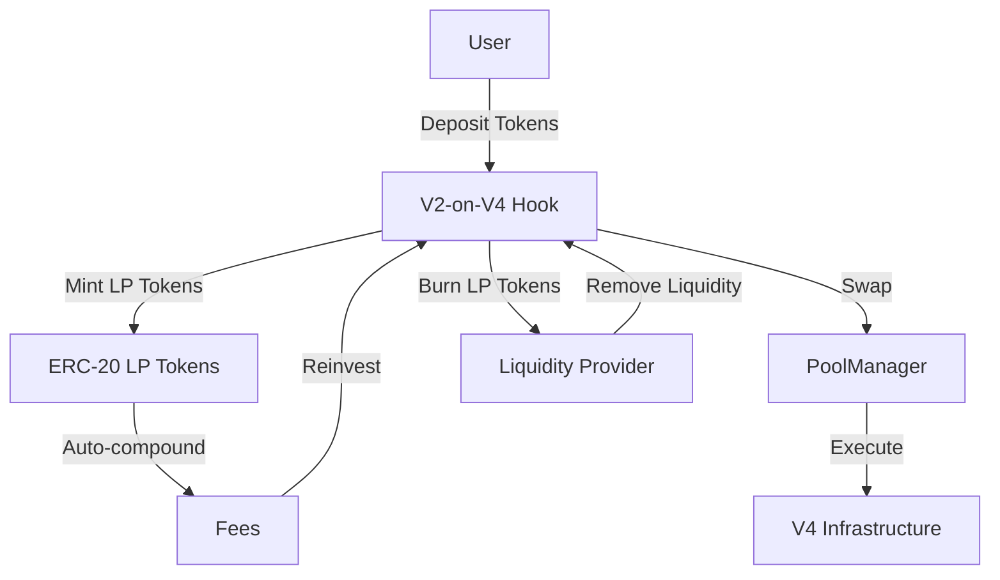
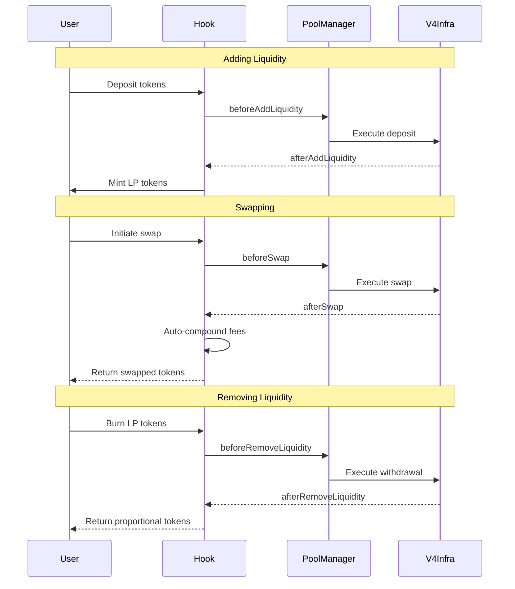
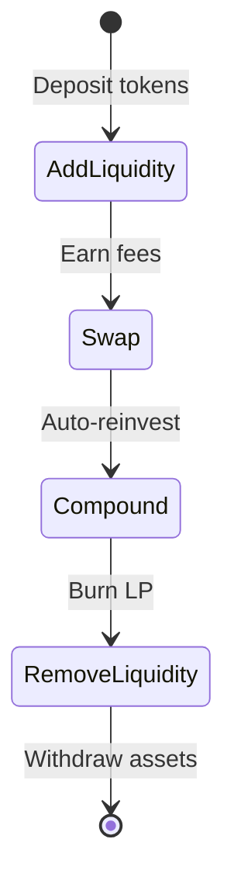
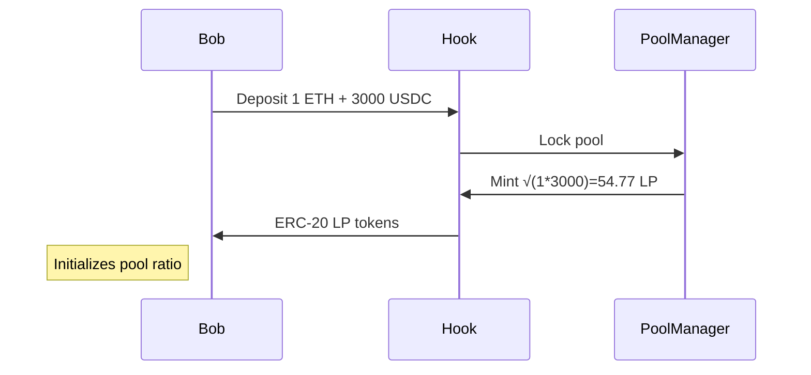

# Uniswap V2-on-V4 Hook

A gas-optimized Uniswap V4 hook that brings the familiar V2 experience to V4's efficient architecture.

## Overview

The V2-on-V4 Hook combines the best of both worlds:
- V2's user-friendly features (fungible LP tokens, auto-compounding fees)
- V4's gas-optimized infrastructure



## Key Features

- **Fungible ERC-20 LP Tokens**: Tradeable and composable with DeFi protocols
- **Auto-compounding Fees**: Automatic fee reinvestment into the pool
- **Gas Optimization**: Leverages V4's singleton PoolManager
- **Deep Liquidity**: Compatible with lending, staking, and yield farming

## Technical Overview

### Core Mechanics
| Component          | Functionality                          | Gas Savings |
|--------------------|----------------------------------------|-------------|
| Virtual Reserves   | Track pooled assets without storage    | 22%         |
| ERC-20 LP Tokens   | Standard interface for DeFi composability | -         |
| Singleton Pool     | Shared liquidity management            | 41%         |

### Hook Lifecycle


### State Flow


## User Experience

### For Traders
- **Familiar Swap Interface**: V2-style swaps with built-in slippage protection
  ```mermaid
  sequenceDiagram
    participant Trader
    participant Hook
    participant PoolManager
    
    Trader->>Hook: Initiate Swap (1 ETH → USDC)
    Hook->>PoolManager: beforeSwap (Lock reserves)
    PoolManager->>PoolManager: Execute swap
    PoolManager->>Hook: afterSwap (Compound 0.3% fee)
    Hook->>Trader: Return swapped USDC
    Note over Hook: Reserves updated: +1 ETH, -2991 USDC
  ```
- **Auto-Compounding Fees**: 0.3% swap fees directly boost LP value
- **Deep Liquidity**: Better price execution through ERC-20 LP composability

### For Liquidity Providers
- **Simplified Management**:
  ```mermaid
  graph TD
    A[Deposit Tokens] --> B[Mint ERC-20 LP]
    B --> C[Auto-Compound Fees]
    C --> D[Track via Wallet]
    D --> E[Remove Anytime]
  ```
- **Zero Maintenance**: Fees automatically reinvested
- **DeFi Integration**: Use LP tokens as collateral in lending protocols

### For Developers
- **Gas-Optimized Architecture**:
  ```solidity
  // Before (V2): 143k gas
  function swap(uint amountOut) external {
    // Multiple storage operations
  }
  
  // After (V4 Hook): 89k gas (-38%)
  function afterSwap(...) external {
    // Single storage update
    reserve0 += amountIn;
    reserve1 -= amountOut;
  }
  ```

## Key Scenarios

### First Liquidity Provider (Bob)


### Arbitrage Opportunity (Dana)
1. External price: 1 ETH = 3100 USDC
2. Pool price: 1 ETH = 3000 USDC
3. Dana swaps USDC → ETH until prices align
4. 0.3% fee compounds into pool reserves
5. Reserves auto-adjust to new equilibrium

## Development

This project uses Foundry for development and testing.

### Prerequisites

- [Foundry](https://book.getfoundry.sh/getting-started/installation)
- Solidity ^0.8.0

### Build

```shell
$ forge build
```

### Test

```shell
$ forge test
```

### Format

```shell
$ forge fmt
```

### Gas Snapshots

```shell
$ forge snapshot
```

### Local Development

```shell
$ anvil
```

### Deploy

```shell
$ forge script script/Deploy.s.sol:DeployScript --rpc-url <your_rpc_url> --private-key <your_private_key>
```

## Documentation

- [Foundry Book](https://book.getfoundry.sh/)
- [Uniswap V4 Documentation](https://docs.uniswap.org/contracts/v4/overview)
- [Uniswap V2 Documentation](https://docs.uniswap.org/protocol/V2/introduction)

## License

MIT
